# Lean Analytics Book Notes

## Several Framework

### 1. AARRR
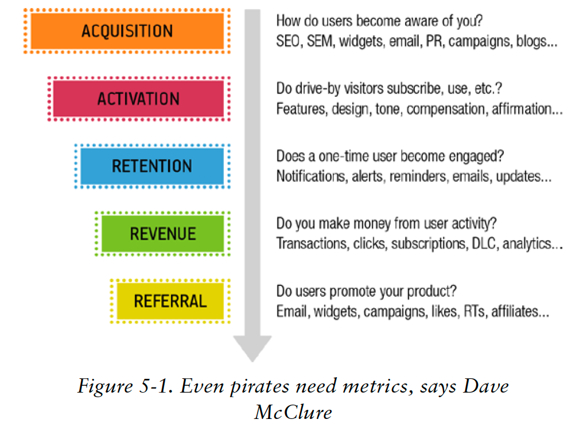
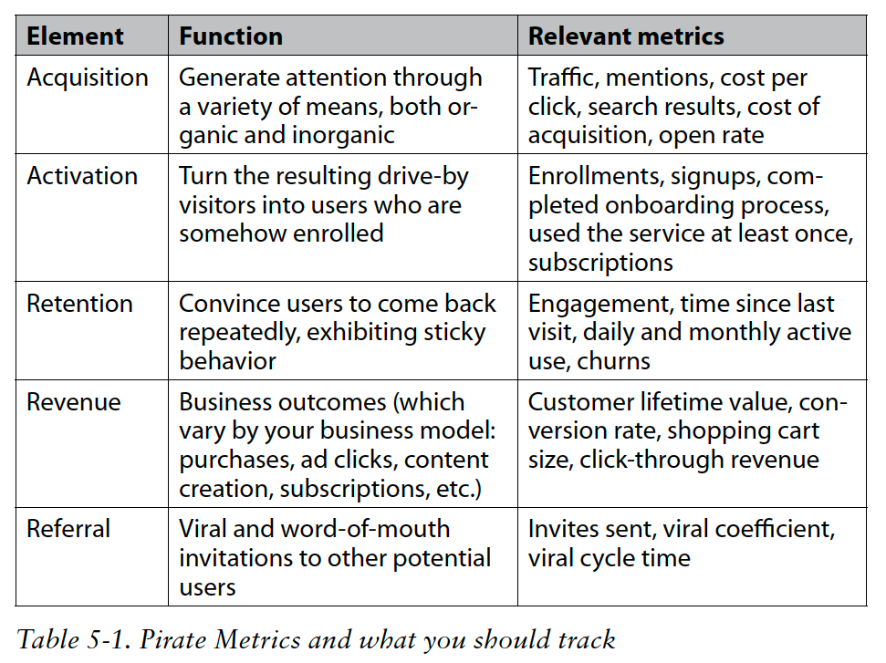

### 2. Eric Ries's Engines of Growth

**Stickiness** - Retention - Churn Rates & Usage Frequency
**Virality (病毒性传播)** - viral coefficient ( the number of new users that each user brings on ) & churn + the action effectiveness that make up the cycle + the speed 
**Paid (Revenue)** - customer lifetime value(CLV) & customer acquisition cost(CAC) - time to customer breakeven( how much it will take to recoup the acquisition cost of a customer)

### 3. Lean Canvas
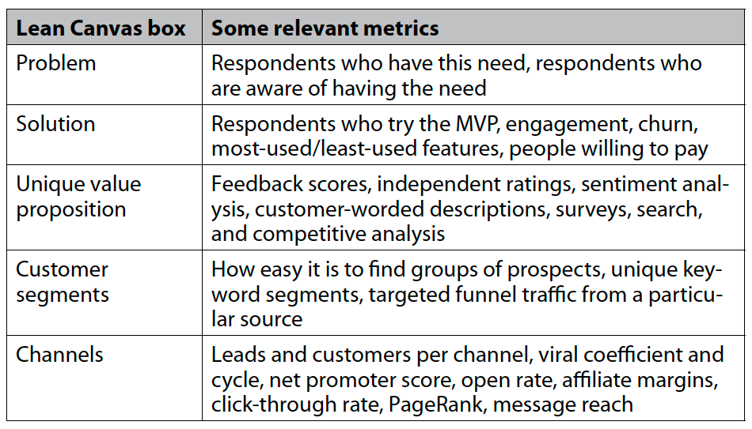
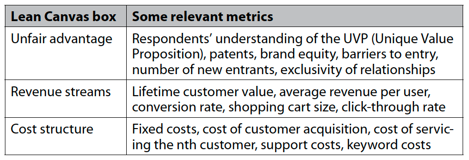

### 4. Startup Growth Pyramid
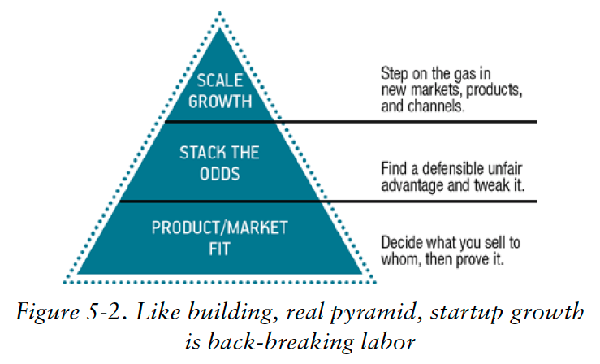

### 5. The Lean Analytics Stages and Gates
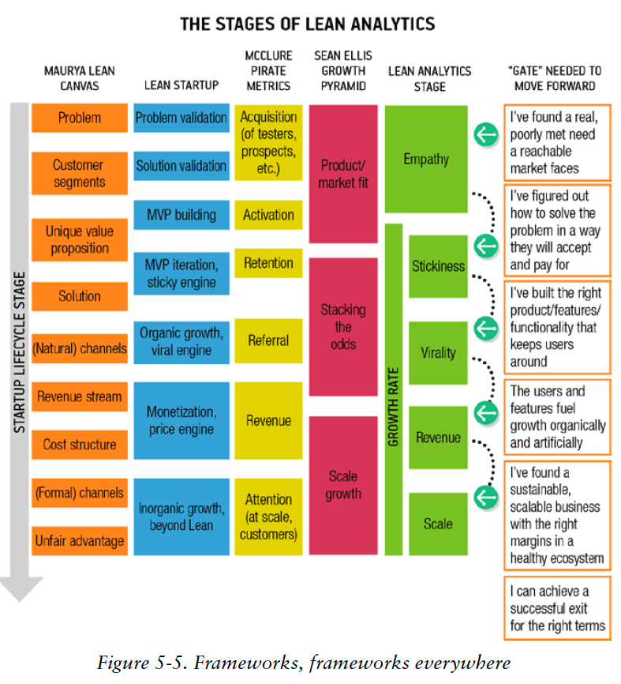

## Principle of Business Model
1. Selling more stuff to more people more often for more money more efficiently
More stuff: adding products or services
More people: more users
More often: stickiness, repeated use
More money: upselling and maximizing the price users will pay
More efficiently: reduce the cost of delivering or supporting, lower the acquisition fee

2. Some aspects of business model
    - Acquisition channel: how people find out about you
    - Selling tactic: how you convince visitors to become users or users become customers
    - Revenue source: how you make money
    - Product type: what value your business offers in return for the revenue
    - Delivery model：how you get your product to your customer
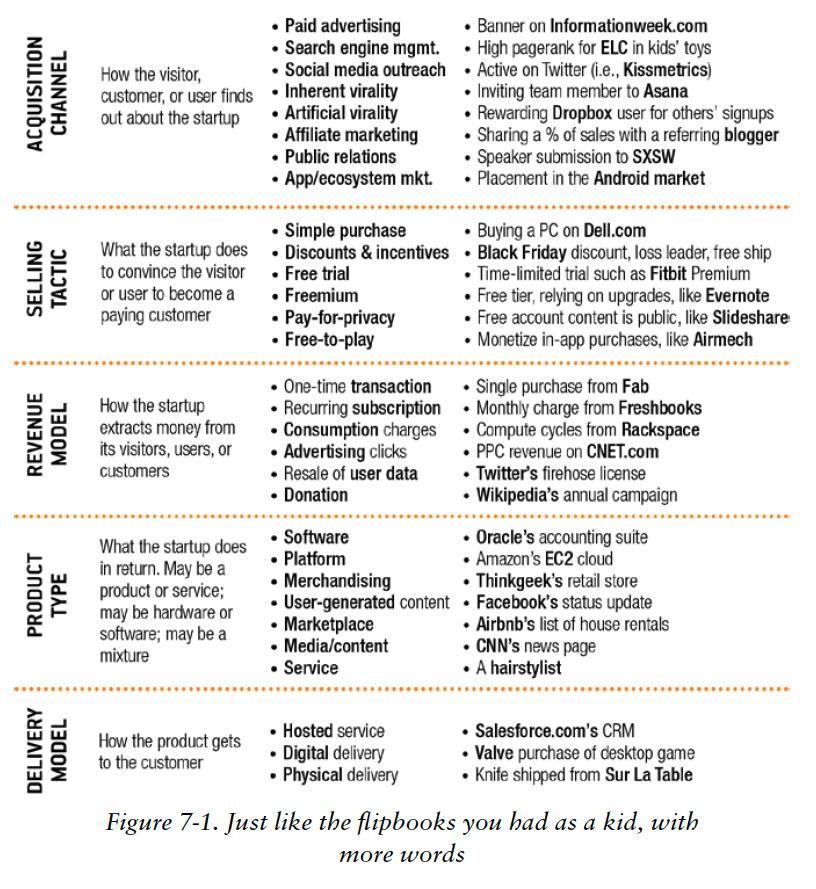    
    
    

## Models for Several Industries(Game rule)
### 1. E-commerce
- Keywords are more important since users tend to use search engine and bounce back and forth.
- Recommendation engines are used more often
- Segmenting traffic
- Purchase are far from the website itself. Social network, email, online community will lead to the purchase
- Loyalty-focused company try to establish the recurring relationship with their users

**Common Metrics:**

- **Conversion Rate**: slice by demographic, copy, referral.  dependent on your type of e-commerce business, and whether your success will be driven by loyalty, new customer acquisition, or a hybrid of the two.
- **Purchase per Year**
- **Shopping cart size**
- **Abandonment**
- **Cost of customer acquisition**: shopping cart size can be the indicator of your revenue, since customer acquisition fee is the same.
- **Revenue per customer(life time value)**
- **Key word and search terms**: search from external site and within your site
- **Recommendation acceptance rate**
- **Virality**
- **Mailing list click through rate**

  **Offline**
- **Shipping time**

- **Stock availability**

**E-Commerce User flow funnel**
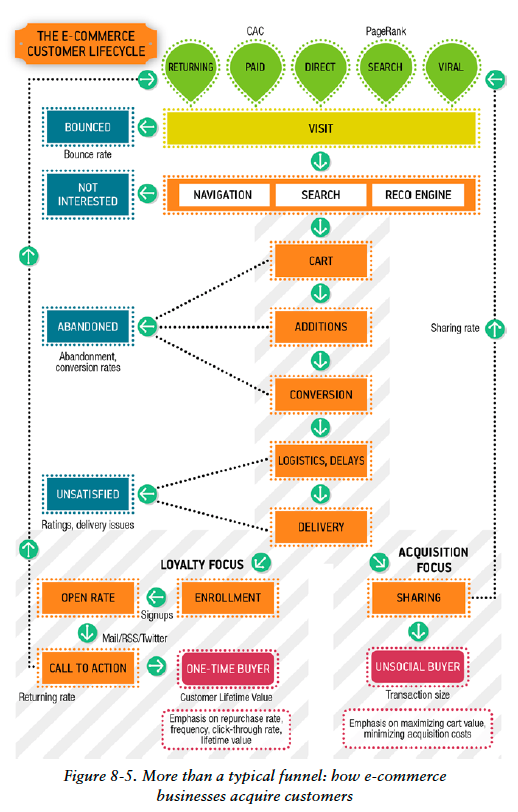

**Key Takeaways**
- know if you’re focused on loyalty or acquisition.
- searches, both off- and on-site, are an increasingly common way of finding something for purchase.
- revenue per customer is more important than conversion rates, repeat purchases or transaction sizes.
- Don’t overlook real-world considerations like shipping, warehouse logistics, and inventory.

### 2. Software as a Service(SaaS)
eg: Salesforce, Gmail.
- They generally generate revenue from a monthly(or yearly) subscription that users pay.
- Offer a tiered model of their service
- Since the cost of adding customers is less, they use a freeminum model of customer acquisition

**Common Metrics:**

- **Attenntion**: How effectively the business attracts visitors.
- **Enrollment**
- **Stickiness**: How much the customers use the product.
- **Conversion**
- **Revenue per customer**
- **Customer acquisition cost**
- **Virality**
- **Upselling**: What makes customers increase their spending, and how often that happens.
- **Uptime and reliability**: How many complaints, problem escalations, or outages the company has.
- **Churn**: should pick a timespan. track chrun for both not paid and paid users seperately. (define an inactive user as someone who hasn't logged in within 90 days). 
(number of churns during period) / (# cusomters at beginning of period)
- **Churn Complications**: 
(#churns during period)/((#customer at beginning of period + #customers at end of period)/2)

two ways to simplify: 1) measure churn by cohort 2) measure churn each day(shorten the time period)

- **Lifetime Value**
- **Engagement**: segment users who do what you want from those who don’t, and identify ways in which they’re
different. To decide whether a change worked, test the change on a subset of your
users and compare that subset’s results to others.

**SaaS User flow funnel**
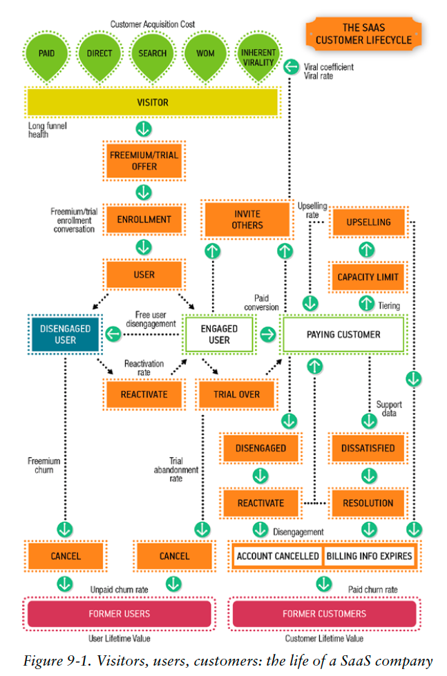

**The complexity of this model comes from two things: the promotional approach and pricing tiers.**

**Key Takeaways**
- While freemium(免费增值) gets a lot of visibility, it’s actually a sales tactic, and
one you need to use carefully.
- In SaaS, churn is everything. If you can build a group of loyal users
faster than they erode, you’ll thrive.
- You need to measure user engagement long before the users become customers, and measure customer activity long before they vanish, to stay ahead of the game.
- Many people equate SaaS models with subscription, but you can monetize on-demand software in many other ways, sometimes to great
effect.

### 3. Free Mobile App
- the a/b testing is hard to do since mobile apps have to go through the app store gatekeeper, which limits the number of iterations a company can undergo
- Some developer advocate trying out the android platform first because it's easier to push frequent updates to users or choose a smaller market to work the bugs out there first
- Make money by:
    1. Downloadable ontent
    2. Flair and customization of in-character appearance and gaming content
    3. Advantages(better weapons, upgrades)
    4. Saving Time
    5. Elimination of countdown timers
    6. Upselling to a paid version
    7. In-game ads

**Common Metrics:**
- **Downloads**
- **Customer acquisition cost(CAC)**
- **Launch Rate**
- **Percent of active users/players**: DAU/MAU
- **Percentage of users who pay**
- **Time to first purchase**
- **Monthly average revenue per user(ARPU)**: or ARPPU(the average revenue per paying user)
- **Ratings click-through**: The percentage of users who put a rating or a review in an app store
- **Virality**
- **Churn**
- **Customer Lifetime Value**: take months or years for a player to leave you, it's harder to estimate the CLV
- **Intallation Volumn**: Getting featured

**How to calculate all the essential metrics for a mobile app**
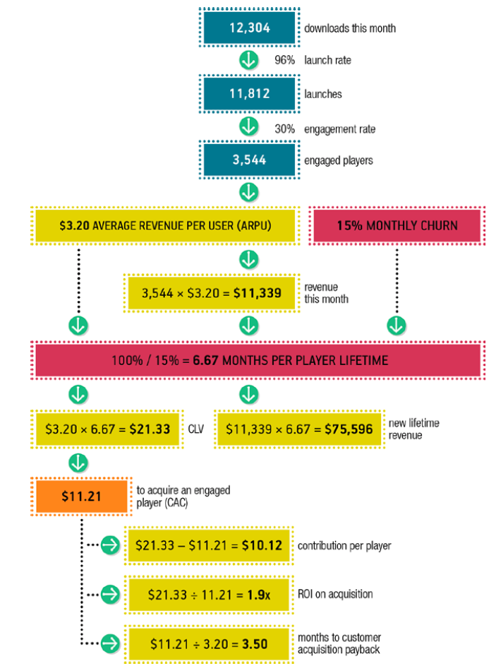

**Free Mobile App Funnel**
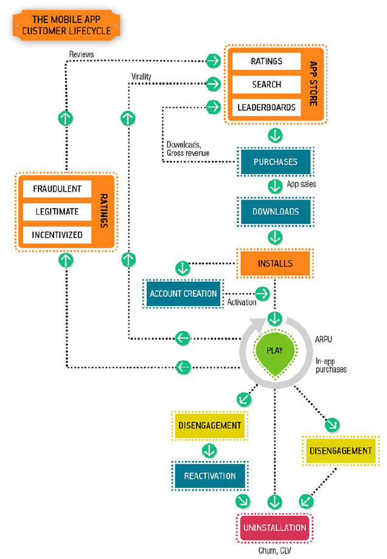

**In-app Monetization VS Advertising**

**Key Takeaway**
- Mobile apps make their money in a variety of ways.
- Most of the money comes from a small number of users; these should be
segmented and analyzed as a distinct group. The key metric is average
revenue per user, but you may also track the average revenue per paying
user, since these “whales” are so distinct.

### 4. Media Site

- Mainly focus on advertisement: display banners or have sponsorship agreement/ the number of click on ads or to a kickback from affiliates / engagement with a visitor
- care most of aall about click-through or display rates, but also need to maximize the time visitors spend on the site, the number of pages they see, and the number of unique visitor
- The affiliate model: brought the visitor to the site, the one has convinced the visitor to click, and the one that ended in a purchase on a third-party site
- pricing for sponsorship and display advertising is often negotiated directly, which depends on the reputation of the site, while pricing for affiliate and pay-per-click aadvertising based on bidding by ad buyers.

**Common Metrics:**

- **Audience and churn**: how many people visit the site and how loyal they are
- **Ad inventory**: the number of impressions that can be monetized
- **Ad rates**: cost per engagement
- **Click-through rates**: how many of the impressions actually turn into money
- **Content/advertising balance**:  The balance of ad inventory rates and content that maximized overall performance
- **Ratio of sessions to click**: indicator of web performance and reliability

**Content vs Advertsing**: 
1. too many ads leads to lousy content and reduced visitor loyalty.
2. if your content is written to attract lucrative ad keywords, it'll feel forced and eem like a paid promotion

**Media Site Funnel**
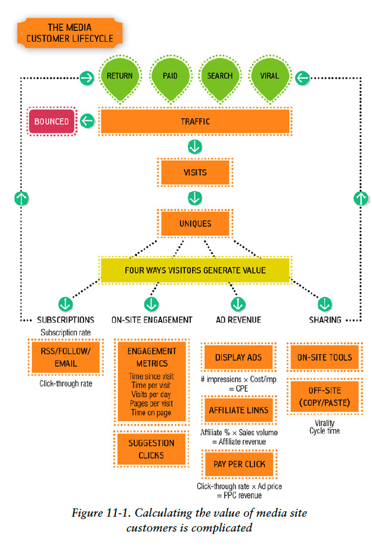

- Hidden affiliates models
- Background noise: if your ads are getting revenues that are hardly better than the background noise a blank ad would get, you need to find out why
- Ad blockers: Reddit runs some ads containing funny content to thank visitors for not blocking ads.
- Paywalls: charge users to access content. There's a tradeoff between ad and subscription revenue. tring to  convert casual referred visitors into recurring-revenue subscribers

**Key Takeaway**
- For media sites, ad revenue is everything—but advertising may include
displays, pay-per-view, pay-per-click, and affiliate models, so tracking
revenues is complex.
- Media sites need inventory (in the form of visitor eyeballs) and
desirability, which comes from content that attracts a demographic
advertisers want.
- It’s hard to strike a balance between having good content and enough
ads to pay the bills.

### 5. User-generated content

**User-generated content Engagement Funnel**
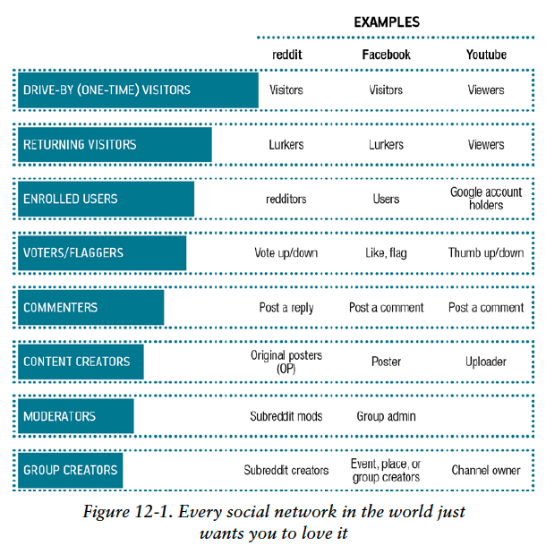

**Common Metrics:**
- **Number of engaged visitors**: the day-to-week ratio / average days since last visit / days since last post / number of votes per day
- **Content creation**: The percentage of visitors who interact with content in some way, from creating it to voting on it
- **Engagement funnel changes**: How well the site moves people to more engaged levels of content over time. comparing the tiers of engagement over time
- **Value of created content**: The business benefit of content, from donations to media clicks
- **Content sharing and virality**: How content gets shared, and how this drives growth
    1. if you're achieving a level of virality that will sustain your business
    2. how content is shared and with whom
    3. understand whether you should conisder a paywall style monetization strategy
- **Notificatoin effectiveness**: The percentage of users who, when told somthing by push, email, or another means, act on it.

**UGC Funnel**
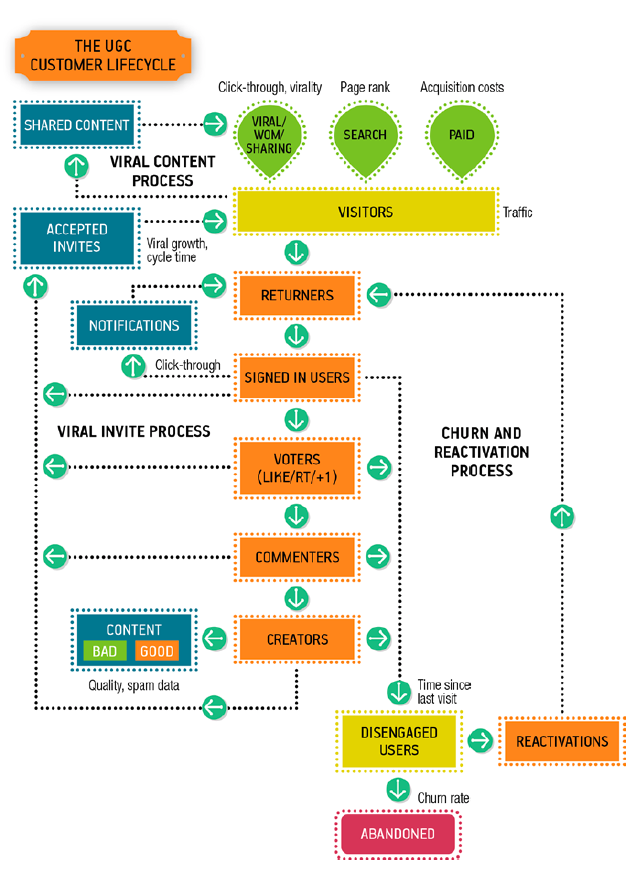

**Key Takeaway**
- Visitor engagement is everything in UGC. You track visitors’
involvement in an “engagement funnel.”
- Many users will lurk, some will contribute lightly, and others will
become dedicated content creators. This 80/20 split exists throughout
the activities you want your users to accomplish.
- To keep users coming back and engaged, you’ll need to notify them of
activity through email and other forms of “interruption.”
- Fraud prevention is a significant amount of work for a UGC site.

### 6. Two-Sided Marketplace

**have to attract both buyers and seller and focus on whomever has the money**
- at first company can create supply and then tranform to commission model
- how's the abilility to create an inventory(supply) or an audience(demand)
- after getting both sides of the market together, your attention will shift to maximizing the proceeds from the market
    - the number of lists
    - the quality of buyers and sellers
    - the percentage of searches
    - what makes a listing desirable
    - track fraud or bad offerings

**Common Metrics:**
- **Buyers and seller growth**:
- **Invertory growth**: such as new listings, the completeness of those listings. If you start to saturate your marketplace, then your growth will come from increasing their listings and the effectiveness of those listings
- **Search effectiveness**
- **Conversion funnels**
- **Ratings and sign of fraud**
- **Percent of flagged listings**
- **Buyers Searches:the ratio of searches to clicked listing**
- **Pricing metrics**
- **Rating at which your're adding buyers and sellers: particularly important in the early stages**

**Two-sided Marketplace Funnel**
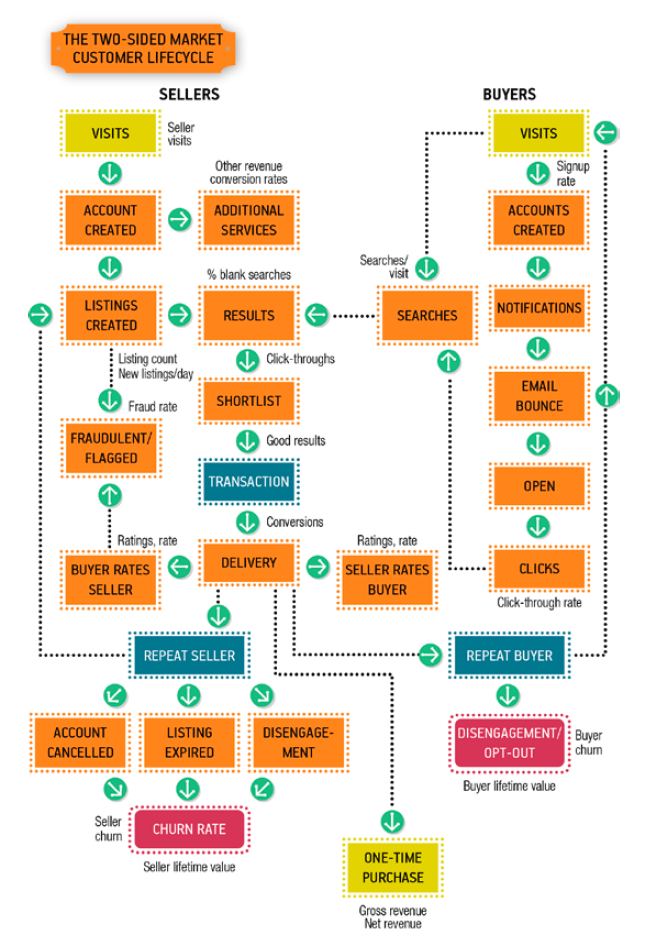

- Successful two-sided marketplaces find a way to artificially populate either the buyer or the seller side early on.
- Fraud and trust
- Keeping the transaction within the network:
    - Refer users to an outside agent to conclude the transaction (e.g., a realtor) and monetize the referral.
    - Charge a fee (instead of a percentage) proportional to the value of the
item the seller is listing.
    - Monetize something else about the market, such as in-site advertising,
shipping services, or favorable placement.
    - Make it impossible for the two parties to connect or find each other’s
identity until after the transaction is confirmed (as discount travel site
Hotwire does).
    - Offer value-added services (such as purchase insurance or escrow) that
encourage participants to keep you in the deal.

**Key Takeaway**
- Two-sided markets come in all shapes and sizes.
- Early on, the big challenge is solving the “chicken and egg” problem
of finding enough buyers and sellers. It’s usually good to focus on the
people who have money to spend first.
- Since sellers are inventory, you need to track the growth of that
inventory and how well it fits what buyers are looking for.
- While many marketplaces take a percentage of transactions, you may
be able to make money in other ways, by helping sellers promote their
products or charging a listing fee.

## Stages

### Stage One: Empathy

*Get insdie someone else's head*

Goal: Find a problem worth solving and a solution that's sufficiently good to garner early traction.

- Your goal is to identify a need you can solve in a way people will pay
money for at scale. Analytics is how you measure your way from your
initial idea to the realization of that goal.
- Early on, you conduct qualitative, exploratory, open-ended discussions
to discover the unknown opportunities.
- Later, your discussions become more quantitative and more convergent,
as you try to find the right solution for a problem.
- You can use tools to get answers at scale and build up an audience as
you figure out what product to build.

### Stage Two: Stickness

- Your goal is to prove that you’ve solved a problem in a way that keeps
people coming back.
- The key at this stage is engagement, which is measured by the time
spent interacting with you, the rate at which people return, and so on.
You might track revenue or virality, but they aren’t your focus yet.
- Even though you’re building the minimal product, your vision should
still be big enough to inspire customers, employees, and investors—
and there has to be a credible way to get from the current proof to the
future vision.
- Don’t step on the gas until you’ve proven that people will do what you
want reliably. Otherwise, you’re spending money and time attracting
users who will leave immediately.
- Rely on cohort analysis to measure the impact of your continuous
improvements as you optimize the stickiness of your product.

### Stage Three: Virality

To calculate your viral coefficient:
1. First calculate the invitation rate, which is the number of invites sent
divided by the number of users you have.
2. Then calculate the acceptance rate, which is the number of signups or
enrollments divided by the number of invites.
3. Then multiply the two together.

### Stage Four: Revenue

- The core equation for the Revenue stage is the money a customer brings
in minus the cost of acquiring that customer. This is the return on
acquisition investment that drives your growth.
- You’re moving from proving you have the right product to proving you
have a real business. As a result, your metrics shift from usage patterns
to business ratios.
- Think of a business as a machine that converts money into greater
sums of money. The ratio of money in to money out, as well as the
maximum amount of money you can put in, dictates the value of the
business.
- You’re trying to figure out where to focus: more revenue per customer,
more customers, more efficiencies, greater frequency, and so on.
- If things aren’t working, it may be easier to pivot your initial product
to a new market rather than starting from scratch.
- While your goal is to grow, you should also keep an eye on breakeven,
because once you can pay your own bills you can survive indefinitely.

### Stage Five: Scale

- When you’re scaling, you know your product and your market. Your
metrics are now focused on the health of your ecosystem, and your
ability to enter new markets.
- You’ll look at compensation, API traffic, channel relationships, and
competitors at this stage—whereas before, these were distractions.
- You need to understand if you’re focused on efficiency or differentiation.
Trying to do both as a way of scaling is difficult. If you’re efficiencyfocused,
you’re trying to reduce costs; if you’re differentiation-focused,
you’re increasing margins.
- As you grow, you’ll need to have more than one metric at a time. Set
up a hierarchy of metrics that keeps the strategy, the tactics, and the
implementation aligned with a consistent set of goals. We call this the
three threes.

## How to evaluate the metrics 

### General
- **Growth rate**: a good growth rate is 5%-7%. If over 10%, it suggests you are doing very well.
    - If the company is at the Revenue Stage, then growth is measured in revenue
    - If it's not charging money yet, growth is measured in active users
    

- **Number of engaged visitors**: 
    - 30% of registered users will use a web-based service at least once a
month. For mobile applications, 30% of the people who download the
app use it each month.
    - 10% of registered users will use the service or mobile app every day.
    - The maximum number of concurrent users will be 10% of the number
of daily users.

- **Pricing Metrics**: do more testing, understanding the right tiers of pricing and the pricee elasiticity of your market

- **Cost of Customer Acquisition**: the acquisition cost should be less than a third of the total value a customer brings you over her lifetime.
    **Reason**:
    - The CLV you've calculated is probably wrong.
    - The acquisition cost is probably wrong
    - Between the time that you spend money to acquire someone and the time you recoup that investment, you're basically lending the customer money
    - Limiting youself to a customer acquisition cost of only a third of your CLV will force you to verify your acquisition costs sonner, which will make your more honest
    

- **Virality**: how many new users each existing user succesfully invites(your viral coefficient) and the time it takes her to do so.
    - A sustained viral coefficient of greater than 1 is an extremely strong indicator of growth, and suggests that you should be focusing on stickiness so you can retain those new users as you add them.
    - distinguish between artificial varality & inherent virality
    - If virality is below 1, it's helping lower your customer acquisition cost. If above 1, you'll grow. If ove 0.75, pretty good.
    - Try to build inherent virality into the product, and track it against your business model. Treat artificial virality the same way you would customer aquisition, and segment it by the value of the new users it brings in.
    

- **Mailing List Effectiveness**:
    - The more frequently you email users, the lower your bounce and humanflagged spam rates (because those addresses quickly get removed from the list), but frequent emailing also tends to reduce engagement metrics like open rate and click-through rate, because recipients get email fatigue.
    - A higher rate of machine-flagged spam leads to a lower rate of humanflagged spam, because humans don’t complain about mail they don’t
receive.
    - Open rate is a fundamentally flawed metric, because it relies on the mail client to load a hidden pixel—which most modern mail applications. don’t do by default.
    - Open and click-through rates will vary significantly, but a well-run
campaign should hit a 20–30% open rate and over 5% click-through.

- **Uptime and Reliability**: the underlying ingrastructure will cause problems
    - For a paid service that users rely on (such as an email application or a
hosted project management application), you should have at least 99.5%
uptime, and keep users updated about outages.

- **Site Engagement**: 
    - An average engaged time on a page of one minute is normal, but there’s wide variance between sites and between pages on a site.
   

- **Web Performance**: 
    - Get your pages to load for a first-time visitor in less than 5 seconds; after 10, and you’ll start to suffer.
    

### E-commerce
**Measure, Learn, and segment properly**

- **Conversion Rate**: 
Company segments: catalog sites / retail giants/ gift sites
    - If you’re an online retailer, you’ll get initial conversion rates of around 2%, which will vary by vertical, but if you can achieve 10%, you’re doing incredibly well
    - there’s a correlation between average order size and conversion rate.
    
    
- **Shopping Cart Abandonment**:
    - Sixty-five percent of people who start down your purchase funnel will abandon their purchase before paying for it.
    

- **Search Effectiveness**
    - Fifty-four percent of iOS web traffic is devoted to search, compared to 36% for the Internet as a whole—and 9 out of 10 mobile searches lead to action, with over half of them leading to a purchase.
    
    
### SaaS

