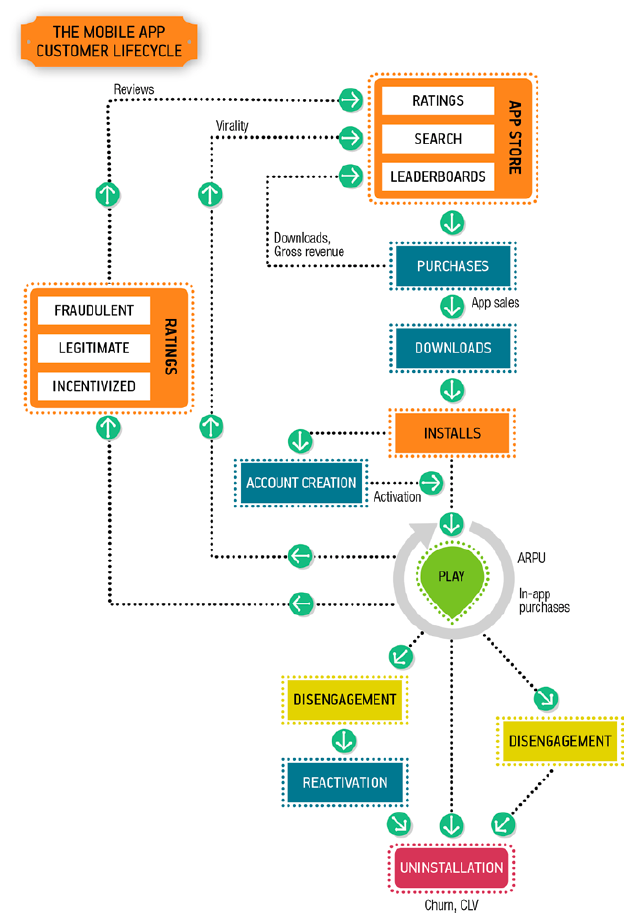

Jupyter Notebook
Untitled
Last Checkpoint: 38 minutes ago
(unsaved changes)
Current Kernel Logo
Python 3 
File
Edit
View
Insert
Cell
Kernel
Widgets
Help
### 4. Media Site
# Lean Analytics Book Notes
​
​
## Principle of Business Model
1. Selling more stuff to more people more often for more money more efficiently
More stuff: adding products or services
More people: more users
More often: stickiness, repeated use
More money: upselling and maximizing the price users will pay
More efficiently: reduce the cost of delivering or supporting, lower the acquisition fee
​
2. Some aspects of business model
Acquisition channel: how people find out about you
Selling tactic: how you convince visitors to become users or users become customers
Revenue source: how you make money
Product type: what value your business offers in return for the revenue
Delivery model：how you get your product to your customer
​
## Models for Several Industries(Game rule)
### 1. E-commerce
- Keywords are more important since users tend to use search engine and bounce back and forth.
- Recommendation engines are used more often
- Segmenting traffic
- Purchase are far from the website itself. Social network, email, online community will lead to the purchase
- Loyalty-focused company try to establish the recurring relationship with their users
​
**Common Metrics:**
​
- **Conversion Rate**: slice by demographic, copy, referral.  dependent on your type of e-commerce business, and whether your success will be driven by loyalty, new customer acquisition, or a hybrid of the two.
- **Purchase per Year**
- **Shopping cart size**
- **Abandonment**
- **Cost of customer acquisition**: shopping cart size can be the indicator of your revenue, since customer acquisition fee is the same.
- **Revenue per customer(life time value)**
- **Key word and search terms**: search from external site and within your site
- **Recommendation acceptance rate**
- **Virality**
- **Mailing list click through rate**
​
  **Offline**
- **Shipping time**
​
- **Stock availability**
​
**E-Commerce User flow funnel**

​
**Key Takeaways**
- know if you’re focused on loyalty or acquisition.
- searches, both off- and on-site, are an increasingly common way of finding something for purchase.
- revenue per customer is more important than conversion rates, repeat purchases or transaction sizes.
- Don’t overlook real-world considerations like shipping, warehouse logistics, and inventory.
​
### 2. Software as a Service(SaaS)
eg: Salesforce, Gmail.
- They generally generate revenue from a monthly(or yearly) subscription that users pay.
- Offer a tiered model of their service
- Since the cost of adding customers is less, they use a freeminum model of customer acquisition
​
**Common Metrics:**
​
- **Attenntion**: How effectively the business attracts visitors.
- **Enrollment**
- **Stickiness**: How much the customers use the product.
- **Conversion**
- **Revenue per customer**
- **Customer acquisition cost**
- **Virality**
- **Upselling**: What makes customers increase their spending, and how often that happens.
- **Uptime and reliability**: How many complaints, problem escalations, or outages the company has.
- **Churn**: should pick a timespan. track chrun for both not paid and paid users seperately. (define an inactive user as someone who hasn't logged in within 90 days). 
(number of churns during period) / (# cusomters at beginning of period)
- **Churn Complications**: 
(#churns during period)/((#customer at beginning of period + #customers at end of period)/2)
​
two ways to simplify: 1) measure churn by cohort 2) measure churn each day(shorten the time period)
​
- **Lifetime Value**
- **Engagement**: segment users who do what you want from those who don’t, and identify ways in which they’re
different. To decide whether a change worked, test the change on a subset of your
users and compare that subset’s results to others.
​
**SaaS User flow funnel**

​
​
**The complexity of this model comes from two things: the promotional approach and pricing tiers.**
​
**Key Takeaways**
- While freemium(免费增值) gets a lot of visibility, it’s actually a sales tactic, and
one you need to use carefully.
- In SaaS, churn is everything. If you can build a group of loyal users
faster than they erode, you’ll thrive.
- You need to measure user engagement long before the users become customers, and measure customer activity long before they vanish, to stay ahead of the game.
- Many people equate SaaS models with subscription, but you can monetize on-demand software in many other ways, sometimes to great
effect.
​
### 3. Free Mobile App
- the a/b testing is hard to do since mobile apps have to go through the app store gatekeeper, which limits the number of iterations a company can undergo
- Some developer advocate trying out the android platform first because it's easier to push frequent updates to users or choose a smaller market to work the bugs out there first
- Make money by:
    1. Downloadable ontent
    2. Flair and customization of in-character appearance and gaming content
    3. Advantages(better weapons, upgrades)
    4. Saving Time
    5. Elimination of countdown timers
    6. Upselling to a paid version
    7. In-game ads
​
**Common Metrics:**
- **Downloads**
- **Customer acquisition cost(CAC)**
- **Launch Rate**
- **Percent of active users/players**: DAU/MAU
- **Percentage of users who pay**
- **Time to first purchase**
- **Monthly average revenue per user(ARPU)**: or ARPPU(the average revenue per paying user)
- **Ratings click-through**: The percentage of users who put a rating or a review in an app store
- **Virality**
- **Churn**
- **Customer Lifetime Value**: take months or years for a player to leave you, it's harder to estimate the CLV
- **Intallation Volumn**: Getting featured
​
**How to calculate all the essential metrics for a mobile app**

​
**Free Mobile App Funnel**

​
**In-app Monetization VS Advertising**
​
​
**Key Takeaway**
- Mobile apps make their money in a variety of ways.
- Most of the money comes from a small number of users; these should be
segmented and analyzed as a distinct group. The key metric is average
revenue per user, but you may also track the average revenue per paying
user, since these “whales” are so distinct.
​
### 4. Media Site
​
## How to evaluate the metrics 
**Growth rate**: a good growth rate is 5%-7%. If over 10%, it suggests you are doing very well.
**Number of engaged visitors**: • 30% of registered users will use a web-based service at least once a
month. For mobile applications, 30% of the people who download the
app use it each month.
• 10% of registered users will use the service or mobile app every day.
• The maximum number of concurrent users will be 10% of the number
of daily users.
​
